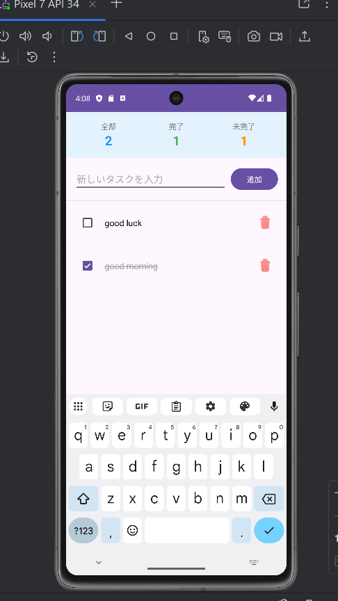

# やることリスト (Android Kotlin版)

## 概要
シンプルなタスク管理アプリ（Android ネイティブ版）

## スクリーンショット

## 機能
- タスクの追加
- タスクの完了/未完了の切り替え
- タスクの削除
- 完了数の統計表示
- データの永続化（アプリを閉じても保存）

## 使用技術
- **言語**: Kotlin
- **アーキテクチャ**: MVVM (Model-View-ViewModel)
- **データベース**: Room Database
- **非同期処理**: Coroutines
- **UI**: XML Layouts, ViewBinding
- **ライブラリ**:
    - AndroidX Core KTX
    - Lifecycle & LiveData
    - RecyclerView

## 開発環境
- Android Studio: Otter | 2025.2.1
- Kotlin: 1.9.0+
- Minimum SDK:API 24 (Android 7.0)
- Target SDK:API 34 (Android 14)

## インストールと実行
- 前提条件
    - Android Studio がインストールされていること
    - Android SDK が設定されていること
- 実行方法
    - プロジェクトを Android Studio で開く
    - Gradle Sync を実行
    - エミュレータまたは実機を接続
    - Run ボタンをクリック

## 開発期間
二週間（2025年11月）

## Flutter版との比較
- Flutter版（Web）
    - クロスプラットフォーム対応
    - 開発速度が速い
    - SharedPreferences 使用
- Kotlin版（Android）
    - Androidネイティブ
    - MVVMアーキテクチャ
    - Room Database 使用
    - パフォーマンスが良い

## 学んだこと
- Kotlin の基本文法
- MVVM アーキテクチャパターン
- Room Database の使い方
- Coroutines による非同期処理
- RecyclerView と Adapter の実装
- LiveData による UI 更新
- ViewBinding の使用

## 今後の改善予定
- 期限設定とリマインダー

## 関連プロジェクト
- Flutter Web版

## 作者
[王依テイ]
